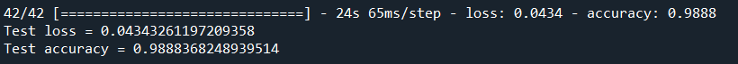
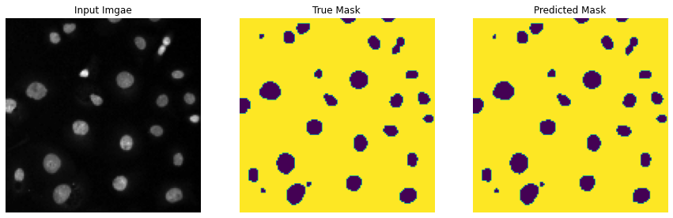

# Nuclei Identification Using Semantic Segmentation With U-Net

## 1. Summary
The aim of this project is to create a deep learning model which is capable of accurately identifying the nuclei of cells accross varied conditions. Semantic segmentation is used to solve this problem as the cell may have different shapes and sizes in varied conditions.

This project is inspired by a documentation on the official TensorFlow website. The documentation can be found [here](https://www.tensorflow.org/tutorials/images/segmentation).

## 2. Methodology
### 2.1 IDE and Frameworks
This project was created using Spyder as the IDE. The framework in this project is Tensorflow Keras and Scikit-learn. Libraries such as Numpy, Matplotlib, and OpenCV are also used in this project.

### 2.2 Data Source
The data used in this project is obtained from [2018 Data Science Bowl dataset](https://www.kaggle.com/c/data-science-bowl-2018).

### 2.3 Data Pipeline
The dataset is separated into train and test folders, where there are inputs folder for images and masks folder for labels in each folders. The labels(masks) are encoded into numerical encoding, such they are in binary values of 0 and 1. The inputs(images) are preprocessed by normalizing them. The train data is then split into train-validation sets in the ratio of 80:20.

### 2.4 Model Pipeline
The model used in this project is a modified U-Net. The U-Net model consists of an encoder(downsampler), which serves as the feature extractor and a decoder(upsampler) to produce pixel-wise output. The structure of the model can be seen in the figure below.

The model is trained using a batch size of 16 and 100 epochs. Early stopping is applied to the model while training at epoch 54. The model reaches an accuracy of 99% and validation accuracy of 98%. The training results is shown in the figures below.

 

At epoch 54, a sample prediction of the training is shown in the figure below, where it can be seen that the model is able to identify the nuclei accurately.

## 3. Results
The model is then evaluated using the test data prepared. The results obtained is shown in the figure below.

The model is also used to make some predictions, which is shown in the figures below.

As observed, the model is able to identify the cells' nuclei with high accuracy.
